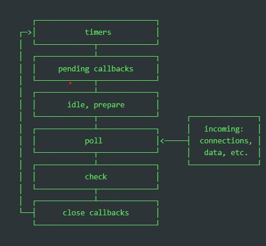
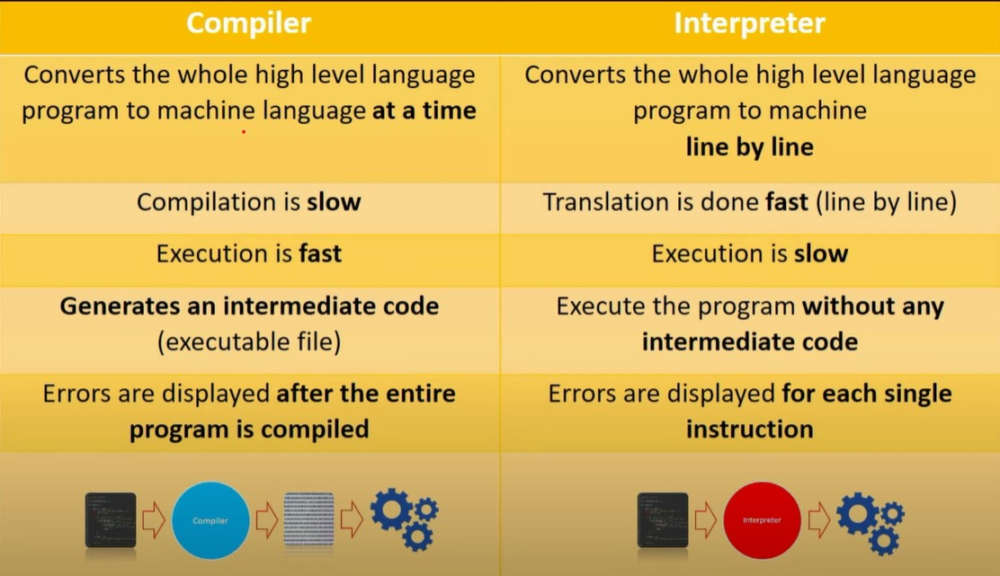

1. Is NodeJS single or multi threaded?
  - single, because JS is single threaded language.

2. Can we make NodeJS multi threading?
  - yes we can spawn several Node JS instances.

3. Why NodeJS uses V8 engine?
  - V8 uses Just In time compiler at runtime to machine code which is increases performance.

4. What is the event loop?
 - Allows to perform non blocking I/O operations
 - Way to use single threaded language to perform multiple operations, by off loading operations to the system kernel whenever possible.
 - Multiple operations executed in the background, when one of these operations completes, it tells NodeJS, so the appropriate callback can be added to the proper queue.
 - 

5. What is callbacks in NodeJS?
  - This is the functions which passed to other function to be executed at the later time.
  
6. How to fix callback hell?

7. Whats is package.json?

8. What is module.exports = {}?

9. What is the difference between NestJS and ExpressJS?
 - ExpressJS more low level. Good choice for small apps.
 - NestJS can be used with ExpressJS or Fastify. Have dependancy injection. Has structure. Better for big apps.
 
10. What is dependancy injection?
 - Mechanism so framework can identify certain services that have been preconfigured. So it can be injected to the other services in runtime.
 - Instead of developer should instantiate different objects and pass it to functions, he can just define this classes and inject them where he need to use them.
 - It makes code more declarative instead of imperative
 - You can write more decoupled code

11. What is streaming in NodeJS?
 - Way of processing data without being read completely into the memory
 - You can curcumvent the memory constraints

12. What are event emitter?
 - Use them to write more decoupled code
 - Event is dispatch, there is a listener function what is registered with that event, when action happens and event dispatch, function called
 - Way of create communication between services, without importing.

13. What is the difference between eventEmitters and publisher + subscribers design pattern?
  - Publisher/Subs can be used across http protocol
  - EventEmitter limited their communication within same local service

14. What is the difference between mongoDb and Postgres?
  - Postgres is relational db, with structure. Allows general SQL queries.
  - Mongo is no-sql db, stores in key, value pairs. More flexible.
  
15. What is the difference between websockets andd rest api?
  - Websockets used in real time communication with backend. Allow dual way communication, client can request data and server can send data at any time.
  - Rest build request response cycle. Client has to make a request.

16. What is graphQL?
  - Allows to query from client varied requests and receive varied response.
  - Rest has strong structure of requests and response.
  - Client can get data from different resourses with single endpoint.
  - Allows to have more flexibility and reduce amount of unused data.
  
17. What is just in time compilation?
 - it is compilation that is being done during the execution of the program.
 - it can optimize most frequently used code
 - it is byte code => machine code
 - another examples of JIT are JVM and CLR
 
18. What is the difference between compiler and interpreter?
 - compiler transpile all code in advance and then execute
 - interpreter transpile and execute line by line
 - 
